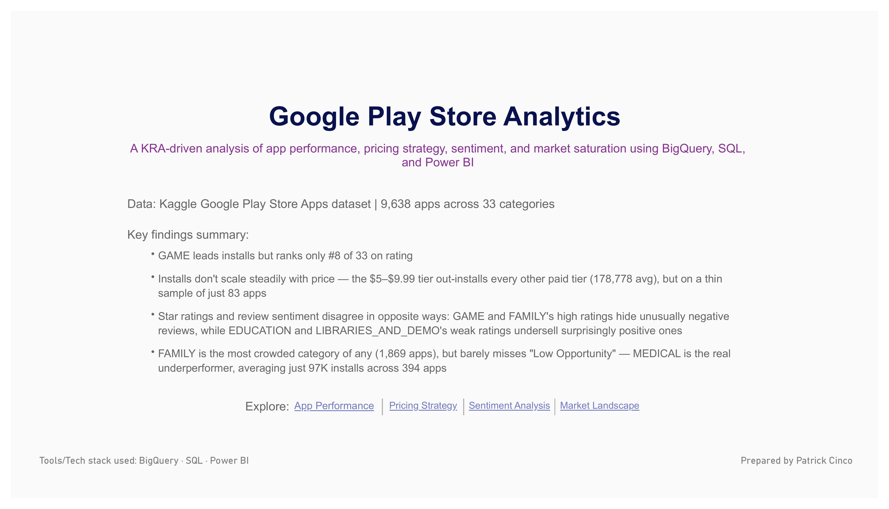
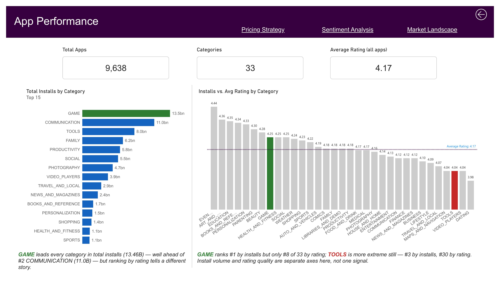
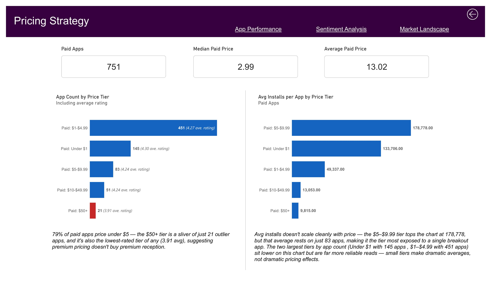
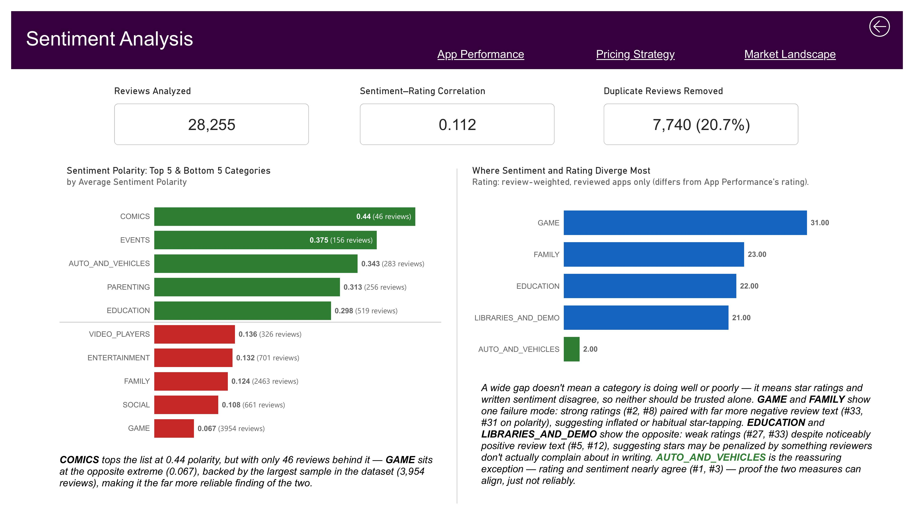
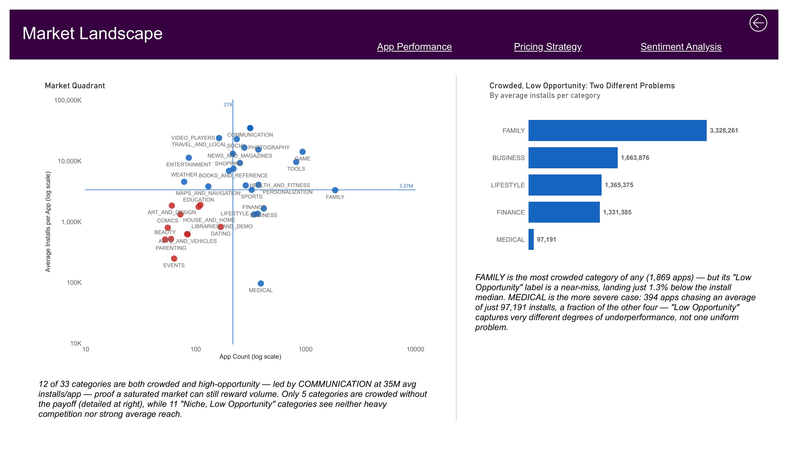

# Google Play Store Analytics

A KRA-driven data analysis project examining app performance, pricing strategy, user sentiment, and market saturation across the Google Play Store, built end-to-end using **BigQuery (SQL)** and **Power BI**.

**Dataset:** [Google Play Store Apps dataset (Kaggle)](https://www.kaggle.com/datasets/lava18/google-play-store-apps)
**Period covered:** May 2010 – August 2018
**Tools:** Google BigQuery · SQL · Power BI

📌 **Note:** This dashboard was built in Power BI Desktop. Full-page screenshots of all 5 pages are below — no Power BI installation needed to review the work. The `.pbix` file is also available in `/dashboard` for anyone who wants to explore it interactively.

---

## Dashboard Preview

### Title Page


### App Performance


### Pricing Strategy


### Sentiment Analysis


### Market Landscape


---

## Project Overview

This project analyzes the Google Play Store app ecosystem across four Key Result Areas (KRAs): **App Performance, Pricing Strategy, Sentiment Analysis,** and **Market Landscape**. Each analysis was built as a validated SQL view in BigQuery, then visualized in a 5-page interactive Power BI dashboard.

Rather than presenting only clean, confirmatory findings, this project documents the full investigative process — including a cross-tool data discrepancy (BigQuery and Power BI disagreeing on total app count) that led to uncovering and fixing a case-sensitivity duplicate-app bug at the SQL source, and a hypothesis (sentiment polarity tracking star rating) that was only weakly confirmed rather than the strong relationship initially expected.

---

## KRA → KPI Framework

| KRA | KPIs Tracked |
|---|---|
| App Performance | Total apps, installs by category, avg rating by category, install-rank vs. rating-rank divergence |
| Pricing Strategy | Paid app count, median vs. average price, avg installs by price tier |
| Sentiment Analysis | Sentiment polarity by category, sentiment–rating correlation, duplicate review rate |
| Market Landscape | App count vs. avg installs by category (market quadrant), crowded/niche & high/low opportunity classification |

---

## Key Findings

1. **Install volume and rating quality are separate signals:** GAME leads every category in total installs (13.46B, well ahead of #2 COMMUNICATION at 11.0B) but ranks only #8 of 33 on average rating; TOOLS is more extreme still — #3 by installs, #30 by rating.

2. **A cross-tool data discrepancy exposed a real duplicate-app bug:** BigQuery's exact-string dedup returned 9,659 unique apps, but Power BI's `DISTINCTCOUNT` returned 9,638 — a 21-app gap traced to apps scraped multiple times under different capitalization (e.g. "I Am Rich" / "I am rich" / "I AM RICH"). Fixed at the SQL source by deduping on `LOWER(TRIM(app_name))` instead of exact string match, with the fix verified three independent ways — BigQuery's raw counts, BigQuery's staged counts, and Power BI's own count all converge on 9,638.

3. **Price doesn't buy reach, and doesn't scale cleanly with itself:** Paid apps average ~76K installs vs. Free's ~8.5M — but within paid tiers, installs don't rise smoothly with price (the $5–$9.99 tier out-installs cheaper tiers, on a thin sample of just 83 apps). Median price ($2.99) is used as the more honest summary statistic than average ($13.02), since a handful of high-priced novelty apps skew the mean.

4. **Sentiment polarity only weakly tracks star rating (r = 0.112), in two opposite directions:** GAME and FAMILY show an inflated-rating pattern — strong star ratings paired with the most negative review text of any category — while EDUCATION and LIBRARIES_AND_DEMO show the reverse: weak ratings despite noticeably positive review text. AUTO_AND_VEHICLES is the rare case where the two measures nearly agree.

5. **"Low Opportunity" isn't one uniform problem:** FAMILY is the most crowded category of any (1,869 apps), yet its "Crowded, Low Opportunity" classification is a statistical near-miss — its avg installs sit just 1.3% below the market median. MEDICAL is the far more severe case in the same quadrant: 394 apps chasing an average of just 97,191 installs, a fraction of every other category in that group.

---

## Repository Structure

```
/sql
  01_stg_apps.sql                        -- Staging layer: cleaned columns, install/size parsing, case-insensitive app dedup
  02_stg_reviews.sql                     -- Staging layer: cleaned review text/sentiment, NaN-string handling
  03_fct_app_performance.sql             -- Category-level installs, ratings, and rank divergence
  04_fct_pricing_strategy.sql            -- Price-tier breakdown: app count, avg rating, avg installs
  05_fct_sentiment_analysis.sql          -- Review sentiment vs. rating by category, correlation, rank-gap analysis
  06_fct_market_landscape.sql            -- Market quadrant classification (crowded/niche x high/low opportunity)

/dashboard
  google_play_app_store_dashboard.pbix   -- Power BI report (5 pages)

/dashboard_images
  01_title_page.jpg
  02_app_performance.jpg
  03_pricing_strategy.jpg
  04_sentiment_analysis.jpg
  05_market_landscape.jpg                -- Full-page screenshots for viewing without Power BI

Dataset: Kaggle Google Play Store Apps dataset (linked above, not included in repo)
```

---

## Methodology

Every SQL view in this project follows the same validation pattern:

1. **Build** — the transformation or aggregation logic
2. **Baseline check** — verify the raw input data is clean before trusting any logic built on it (e.g., value ranges, NULL/NaN checks)
3. **Structural check** — confirm the transformation produced the expected shape (row counts, distinct combinations, two-grain totals)
4. **Content check** — inspect the actual values for correctness and insight
5. **Conclusion** — a stated, one-paragraph takeaway, written even when the result disproves the original hypothesis

This structure is intentional: it demonstrates not just SQL syntax, but a habit of verifying assumptions against data rather than accepting first-pass results at face value. The clearest example is `01_stg_apps.sql`: a routine structural check surfaced a mismatch between BigQuery's and Power BI's total app counts, which was traced to a case-sensitivity difference between the two tools' text matching — and fixed at the SQL source rather than patched over in the dashboard.

---

## Dashboard Pages

| Page | Focus |
|---|---|
| **Title / Overview** | Project summary, dataset scope, and navigation |
| **App Performance** | Category-level installs and ratings, and where the two diverge |
| **Pricing Strategy** | Free vs. paid economics, price-tier breakdown, median vs. average price |
| **Sentiment Analysis** | Review sentiment vs. star rating by category, correlation, and rank divergence |
| **Market Landscape** | Market quadrant analysis — competition (app count) vs. reward (avg installs) by category |

---

## Tech Stack

- **Google BigQuery** — data warehousing, SQL transformation layer
- **SQL** — staging, aggregation, and validation logic
- **Power BI** — data modeling, DAX measures, dashboard visualization

---

## Author

Patrick Cinco
